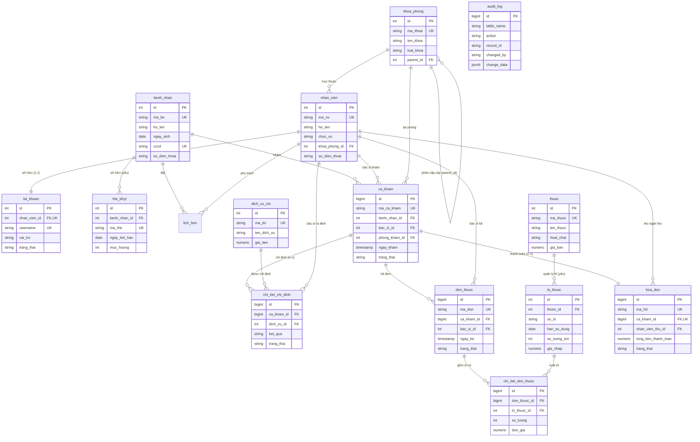

# SƠ ĐỒ THỰC THỂ LIÊN KẾT (ERD) - DT01 QUẢN LÝ BỆNH VIỆN

> Sơ đồ quan hệ thực thể (ERD) gồm **15 bảng** chuẩn hóa 3NF, đáp ứng đầy đủ quan hệ 1-1, 1-n, n-n, thực thể yếu và phân cấp cây.

```mermaid
erDiagram
    khoa_phong ||--o{ khoa_phong : "phân cấp cây (parent_id)"
    khoa_phong ||--o{ nhan_vien : "trực thuộc"
    nhan_vien ||--|| tai_khoan : "sở hữu (1-1)"
    
    benh_nhan ||--o{ the_bhyt : "sở hữu (yếu)"
    benh_nhan ||--o{ lich_hen : "đặt"
    nhan_vien ||--o{ lich_hen : "phụ trách"
    
    benh_nhan ||--o{ ca_kham : "khám"
    nhan_vien ||--o{ ca_kham : "bác sĩ khám"
    khoa_phong ||--o{ ca_kham : "tại phòng"
    
    ca_kham ||--o{ chi_tiet_chi_dinh : "chỉ định (n-n)"
    dich_vu_cls ||--o{ chi_tiet_chi_dinh : "được chỉ định"
    nhan_vien ||--o{ chi_tiet_chi_dinh : "bác sĩ ra lệnh"
    
    ca_kham ||--o{ don_thuoc : "kê đơn"
    nhan_vien ||--o{ don_thuoc : "bác sĩ kê"
    
    thuoc ||--o{ lo_thuoc : "quản lý lô (yếu)"
    don_thuoc ||--o{ chi_tiet_don_thuoc : "gồm (n-n)"
    lo_thuoc ||--o{ chi_tiet_don_thuoc : "xuất từ"
    
    ca_kham ||--|| hoa_don : "thanh toán (1-1)"
    nhan_vien ||--o{ hoa_don : "thu ngân thu"

    khoa_phong {
        int id PK
        string ma_khoa UK
        string ten_khoa
        string loai_khoa
        int parent_id FK
    }

    nhan_vien {
        int id PK
        string ma_nv UK
        string ho_ten
        string chuc_vu
        int khoa_phong_id FK
        string so_dien_thoai
    }

    tai_khoan {
        int id PK
        int nhan_vien_id FK,UK
        string username UK
        string vai_tro
        string trang_thai
    }

    benh_nhan {
        int id PK
        string ma_bn UK
        string ho_ten
        date ngay_sinh
        string cccd UK
        string so_dien_thoai
    }

    the_bhyt {
        int id PK
        int benh_nhan_id FK
        string ma_the UK
        date ngay_het_han
        int muc_huong
    }

    ca_kham {
        bigint id PK
        string ma_ca_kham UK
        int benh_nhan_id FK
        int bac_si_id FK
        int phong_kham_id FK
        timestamp ngay_kham
        string trang_thai
    }

    dich_vu_cls {
        int id PK
        string ma_dv UK
        string ten_dich_vu
        numeric gia_tien
    }

    chi_tiet_chi_dinh {
        bigint id PK
        bigint ca_kham_id FK
        int dich_vu_id FK
        string ket_qua
        string trang_thai
    }

    thuoc {
        int id PK
        string ma_thuoc UK
        string ten_thuoc
        string hoat_chat
        numeric gia_ban
    }

    lo_thuoc {
        int id PK
        int thuoc_id FK
        string so_lo
        date han_su_dung
        int so_luong_ton
        numeric gia_nhap
    }

    don_thuoc {
        bigint id PK
        string ma_don UK
        bigint ca_kham_id FK
        int bac_si_id FK
        timestamp ngay_ke
        string trang_thai
    }

    chi_tiet_don_thuoc {
        bigint id PK
        bigint don_thuoc_id FK
        int lo_thuoc_id FK
        int so_luong
        numeric don_gia
    }

    hoa_don {
        bigint id PK
        string ma_hd UK
        bigint ca_kham_id FK,UK
        int nhan_vien_thu_id FK
        numeric tong_tien_thanh_toan
        string trang_thai
    }

    audit_log {
        bigint id PK
        string table_name
        string action
        string record_id
        string changed_by
        jsonb change_data
    }
```
